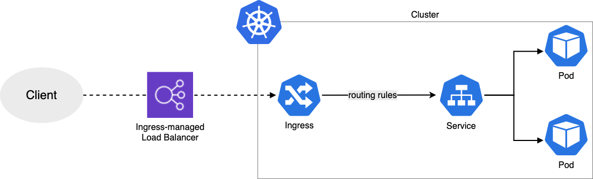

# Altlayer-Assignment

## Prerequisites:

```sh
kubectl
helm 
flux
awscli 
```
## Diagram Basic 


## Mission 1: Terraform: EKS
* Go the folder [terraform](../terraform/README.md)
- I dont't have a bastion host or a VPN. I need to enable a `public_endpoint` as well to access it from my laptop.
- I created a `workflow` to manage tf code with easy collaboration between within the team.
- Have using S3 to Backend store state
- Using terraform module vpc and eks 

***Verify the Cluster***
Use `kubectl` commands to verify your cluster configuration.
```sh
π altlayer-assignment ✗ ❯ kubectl cluster-info
Kubernetes control plane is running at https://FA20253D29D0BC2E5BCF3FF54999478A.gr7.ap-southeast-1.eks.amazonaws.com
CoreDNS is running at https://FA20253D29D0BC2E5BCF3FF54999478A.gr7.ap-southeast-1.eks.amazonaws.com/api/v1/namespaces/kube-system/services/kube-dns:dns/proxy
```
Now verify that all three worker nodes are part of the cluster.
```sh
π altlayer-assignment ✗ ❯ kubectl get node
NAME                                             STATUS   ROLES    AGE    VERSION
ip-10-0-28-201.ap-southeast-1.compute.internal   Ready    <none>   114m   v1.29.6-eks-1552ad0
ip-10-0-61-137.ap-southeast-1.compute.internal   Ready    <none>   115m   v1.29.6-eks-1552ad0
```
Ready to use.

## Mission 2: CICD
The token is very important for authentication between the cluster and the GitHub repository. 
So I decided bootstrap via Deploy Keys. 
Run the bootstrap.
```sh
π altlayer-assignment ✗ ❯ flux bootstrap git \
  --branch=main \
  --url=ssh://git@github.com/duyhenryer/altlayer-assignment\
  --private-key-file=/Users/duy.dovan/.ssh/me/id_ed25519 \
  --components-extra=image-reflector-controller,image-automation-controller \
  --path=kubernetes/clusters/demo
```

[Bootstrap docs](https://fluxcd.io/flux/installation/bootstrap/github/)
## Mission 3: EKS Monitoring
Tasks:
1. Deploy kube-prometheus-stack via FluxCD
  - Go to the folder `kubernetes/infra/controllers/` to deploy it.
2. Grafana (more)
  - Access to link: [http://grafana.duyne.me ](http://grafana.duyne.me)
  - user/pass: `admin/dem@123`
  - Dashboard for Kubernetes and Ingress-Nginx

## Mission 4: Sample App Deployment
Tasks:
1. Dockerize your Hello World web app.
  - A simple app with FastAPI to easy test.
  - Have `workflow` to build and push Github Registry
  - Using Github Action
2. Create a helm chart for it.
  - I created a helm-chart in folder `helm`. Its sample chart to deploy.
  - Using Github Action
  - Have `workflow` to release chart via OCI of Github
  - OCI Registry for Chart
    ```sh
    # login to registry and then
    helm pull oci://ghcr.io/duyhenryer/altlayer-assignment/altlayer-chart --version 0.1.0
    ```
3. Deploy it via FluxCD.
  - I deployed app in folder `kubernetes/apps`
  - Access to link: [http://apps.duyne.me/](http://apps.duyne.me/)
  - Test via `curl`
    ```
    π altlayer-assignment ✗ ❯ curl http://apps.duyne.me
    {"message":"Hello, World! - Altlayer "}
    ```

## Mission 5: Stress Testing
I created a file to load test `asciiart-load-test.yml`

<details>
<summary> </summary>

```yaml
config:
  # This is a test server run by team Artillery
  # It's designed to be highly scalable
  target: http://apps.duyne.me
  phases:
    - duration: 60
      arrivalRate: 1
      rampTo: 5
      name: Warm up phase
    - duration: 60
      arrivalRate: 5
      rampTo: 10
      name: Ramp up load
    - duration: 30
      arrivalRate: 10
      rampTo: 30
      name: Spike phase
  # Load & configure a couple of useful plugins
  # https://docs.art/reference/extensions
  plugins:
    ensure: {}
    apdex: {}
    metrics-by-endpoint: {}
  apdex:
    threshold: 100
  ensure:
    thresholds:
      - http.response_time.p99: 100
      - http.response_time.p95: 75
scenarios:
  - flow:
      - loop:
          - get:
              url: '/'
        count: 100
```
</details>

```sh
artillery run test.yml --record --key $TOKEN
```
<details>
<summary>Summary report</summary>

```yaml
.... 

--------------------------------
Summary report @ 15:12:54(+0700)
--------------------------------

apdex.frustrated: .............................................................. 555
apdex.satisfied: ............................................................... 75293
apdex.tolerated: ............................................................... 30252
errors.ENOTFOUND: .............................................................. 1
errors.ETIMEDOUT: .............................................................. 168
http.codes.200: ................................................................ 106100
http.downloaded_bytes: ......................................................... 4137900
http.request_rate: ............................................................. 862/sec
http.requests: ................................................................. 106269
http.response_time:
  min: ......................................................................... 1
  max: ......................................................................... 902
  mean: ........................................................................ 72.2
  median: ...................................................................... 45.2
  p95: ......................................................................... 165.7
  p99: ......................................................................... 284.3
http.responses: ................................................................ 106100
plugins.metrics-by-endpoint./.codes.200: ....................................... 106100
plugins.metrics-by-endpoint./.errors.ENOTFOUND: ................................ 1
plugins.metrics-by-endpoint./.errors.ETIMEDOUT: ................................ 168
plugins.metrics-by-endpoint.response_time./:
  min: ......................................................................... 1
  max: ......................................................................... 902
  mean: ........................................................................ 72.2
  median: ...................................................................... 45.2
  p95: ......................................................................... 165.7
  p99: ......................................................................... 284.3
vusers.completed: .............................................................. 1061
vusers.created: ................................................................ 1230
vusers.created_by_name.0: ...................................................... 1230
vusers.failed: ................................................................. 169
vusers.session_length:
  min: ......................................................................... 5001.9
  max: ......................................................................... 13158.6
  mean: ........................................................................ 7496.2
  median: ...................................................................... 6312.2
  p95: ......................................................................... 11734.2
  p99: ......................................................................... 12213.1

Checks:
fail: http.response_time.p95 < 75
fail: http.response_time.p99 < 100

Apdex score: 0.852205466540999 (good)

```
</details>


## Todo more 
- Automate image updates
- SSL
- Autoscale via Karpenter